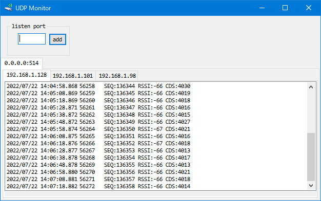

# UdpMonitor

# 機能
- 指定のポートで UDP パケットを待ち受けし、受信した電文を相手先毎に保存します。
- 受信電文を選択すると内容がクリップボードに入ります。
- 選択状態で表示範囲はロックされます。
- 右クリックで未選択状態に戻り表示範囲のロックは解けます。
- syslog（514/udp）は最初から待ち受けします。

### 注意
- 当ソフトがパケットを受信できるように Windows の Firewall 設定を緩めて下さい。
